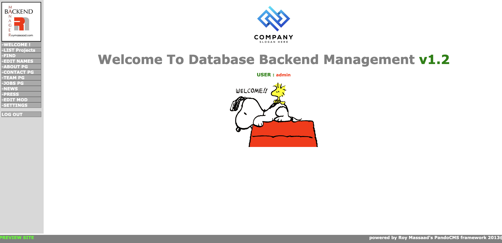
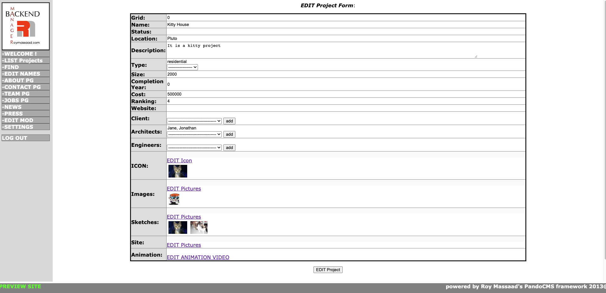
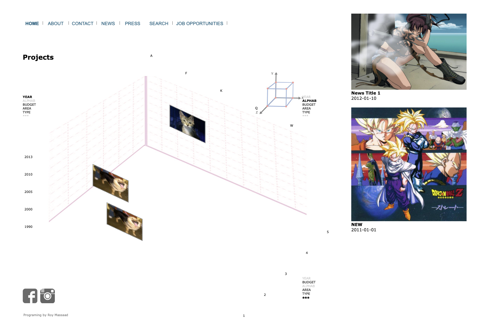

# pando_cms
PHP 5 custom CMS for portfolio websites

I built it and used it/updated it from 2009 to 2012

Simple but allowed to customize its template admin dashboard for CRUD operations

Comes with one of its demo frontends for portofolios

Missing alot of features compared to modern frameworks like Lavarel and Yii, but it did get the job done 

Import .sql

Some libraries/extensions wont work like the flash video player

